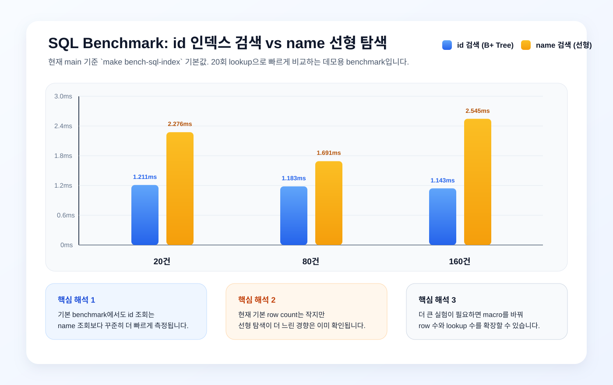

# B+ Tree Index

정글 7주차 DB 프로젝트 레포지토리입니다.
이 저장소는 week6 SQL 처리기 작업물을 기반으로 시작했고, week7에서는 메모리 기반 `B+ Tree` 인덱스를 붙여 `INSERT` / `SELECT` 경로를 개선하는 것을 목표로 합니다.

## 팀원

- jiun
- minsuk
- seokje
- sein

## 프로젝트 목표

- `B+ Tree` 핵심 개념을 팀 전체가 설명할 수 있게 정리
- `search`, `insert`, `split` 의사코드와 한글 주석 기준 확정
- 사이클 방식으로 `구조체 + search`, `insert + split`, `SQL 연동` 구현
- 수렴 단계에서 `벤치마크`, `테스트`, `엣지 케이스`, `코드 정리` 마무리

## 현재 레포 상태

- 기존 week6 SQL 처리기 코드는 그대로 보존되어 있습니다.
- week7 시작을 위해 `B+ Tree` 골격 파일, 테스트, 벤치마크, 협업 문서를 추가했습니다.
- 사이클 1 선정 코드 기준으로 `search` 구현, 구조체 확정, `search` 테스트, 시각화 시뮬레이터가 반영되어 있습니다.

## 빌드 및 실행

```bash
make
./bptree
```

```bash
make test
make bench
```

기존 SQL 처리기와 benchmark는 아래 명령으로 실행할 수 있습니다.

```bash
make sqlparser
make test-sqlparser
make bench-sql-index
make bench-bptree-scale
make bench-index-graph
python3 server.py
```

- `make`: B+ Tree 실행 파일을 빌드합니다.
- `make test`: 구조 테스트와 search 테스트를 실행합니다.
- `make bench`: 기본 B+ Tree benchmark를 실행합니다.
- `make sqlparser`: SQL 처리기 실행 파일을 빌드합니다.
- `make test-sqlparser`: SQL parser, executor, storage, 인덱스 연동 테스트를 실행합니다.
- `make bench-sql-index`: SQL `WHERE id = ?` 와 `WHERE name = ?` 조회 성능을 비교합니다.
- `make bench-bptree-scale`: 데이터 증가에 따른 B+ Tree insert/search 성능을 확인합니다.
- `make bench-index-graph`: full scan, B-Tree, B+ Tree를 같은 입력 크기로 비교합니다.
- `python3 server.py`: 브라우저에서 SQL 실행과 benchmark 버튼을 사용할 수 있는 로컬 서버를 실행합니다.

현재 기본 B+ Tree 차수는 `BPTREE_ORDER = 64`입니다.

## 프로젝트 구조

### week7 핵심 파일

- `src/bptree.h`: B+ Tree 구조체와 함수 선언
- `src/bptree.c`: B+ Tree 생성/해제와 핵심 로직 구현
- `src/bptree_main.c`: `bptree` 실행 진입점
- `src/storage.c`: SQL 처리기와 B+ Tree 인덱스 연동 로직
- `test/test_structure.c`: 구조 불변식 검증
- `test/test_search.c`: search 동작과 엣지 케이스 검증
- `benchmark/bench_search.c`: 기본 검색 벤치마크
- `benchmark/bench_sql_index.c`: SQL 인덱스 benchmark
- `benchmark/bench_bptree_scale.c`: B+ Tree scale benchmark
- `benchmark/bench_index_graph.c`: full scan, B-Tree, B+ Tree 비교 benchmark
- `docs/bptree-search-simulator.html`: 사람이 `search` 흐름을 볼 수 있는 시뮬레이터
- `WORKFLOW.md`: 팀 협업 규칙

### 현재 재활용 중인 기존 week6 파일

- `src/main.c`
- `src/parser.c`
- `src/executor.c`
- `src/storage.c`
- `include/types.h`
- `tests/`

## 오늘 진행 순서

### 정렬 Phase (`11:00~12:00`)

- `B+ Tree` 개념 정리
- `search / insert / split` 의사코드 작성
- 구현용 한글 주석 방향 합의

### 점심 (`12:00~13:00`)

- SQL 처리기와 `B+ Tree`를 어디서 연결할지 가볍게 논의

### 사이클 1 (`13:00~14:00`)

- 각자 `구조체 + search` 구현
- 공유 후 1벌 선정, `main` 반영

### 사이클 2 (`14:00~15:00`)

- 각자 `insert + split` 구현
- 공유 후 1벌 선정, `main` 반영

### 사이클 3 (`15:00~16:00`)

- 각자 SQL `INSERT / SELECT` 연동
- 공유 후 1벌 선정, `main` 반영

### 수렴 단계 (`16:00~19:30`)

- `feat/benchmark`
- `feat/test`
- `feat/edge-case`
- `feat/cleanup`

## 꼭 이해해야 하는 개념

1. 내부 노드와 리프 노드의 역할 차이
2. `search`가 루트에서 리프까지 내려가는 방식
3. `insert` 후 overflow가 나면 `split`이 일어나는 이유
4. 리프 노드 연결이 범위 검색에 주는 이점
5. `INSERT` / `SELECT WHERE id = ...` 에서 인덱스가 연결되는 지점

## 참고 문서

- [시간표](docs/timetable.txt)
- [세팅 담당자 문서](docs/prompt-setup-leader.md)
- [팀원 참여 문서](docs/prompt-setup-member.md)
- [B+ Tree 퀴즈](docs/quiz-bptree.md)
- [B+ Tree 퀴즈 답안](docs/quiz-bptree-answer.md)

## B+ Tree 설명

<!-- TODO: 정렬 Phase에서 팀 합의 내용으로 채우기 -->

## 벤치마크 결과

현재 `main`의 기본 benchmark 기준 결과입니다.

### SQL 인덱스 benchmark

`make bench-sql-index`

| 데이터 건수 | id 검색 시간 (B+ Tree) | name 검색 시간 (선형) | 배율 차이 |
|---|---:|---:|---:|
| 10,000 | 24.850ms | 199.026ms | 8.01x |
| 100,000 | 10.362ms | 1865.738ms | 180.05x |
| 1,000,000 | 8.868ms | 17889.915ms | 2017.36x |



- 현재 기본 SQL benchmark는 `10,000 / 100,000 / 1,000,000` rows, `500`회 `id` lookup, `500`회 `name` lookup 기준으로 실행됩니다.
- `WHERE id = ?` 는 B+ Tree 인덱스를 사용하고, `WHERE name = ?` 는 선형 탐색을 사용합니다.
- `1,000,000` rows에서는 `id` 인덱스 조회가 `name` 선형 탐색보다 약 `2017배` 빠르게 측정됐습니다.

### B+ Tree scale benchmark

`make bench-bptree-scale`

| 데이터 건수 | B+ Tree insert | B+ Tree search | linear search |
|---|---:|---:|---:|
| 1,000 | 0.072ms | 0.050ms | 0.167ms |
| 5,000 | 0.360ms | 0.072ms | 0.809ms |
| 10,000 | 0.770ms | 0.075ms | 1.543ms |

- `bptree search`는 row 수가 커져도 매우 낮은 시간으로 유지됩니다.
- `linear search`는 row 수 증가에 따라 더 가파르게 증가합니다.

### 그래프용 비교 benchmark

`make bench-index-graph ROWS=1000000 REQUESTS=5000`

- full scan `SELECT`: `1807.790ms`
- B-Tree index `SELECT`: `1.381ms`
- B+ Tree index `SELECT`: `1.324ms`

## 테스트 결과

현재 확인된 기본 테스트 결과는 아래와 같습니다.

- B+ Tree 구조 테스트: `6/6 PASS`
- B+ Tree search 테스트: `11/11 PASS`
- parser 테스트: `197 passed, 0 failed`
- RowSet / storage select 테스트: `33 passed, 0 failed`
- SQL 인덱스 통합 테스트: `passed`
- auto-id 생략 `INSERT` 테스트: `passed`
- auto-id 연속 증가 테스트: `passed`
- 빈 트리 검색 테스트: `passed`
- 존재하지 않는 key 검색 테스트: `passed`
- `INT_MAX` 경계값 search 테스트: `passed`
- `INT_MAX` 경계값 구조 불변식 테스트: `passed`

실행 예시는 아래와 같습니다.

```text
[SEARCH 12/12] int max boundary key search ... PASS
Search tests passed! (12/12)
[STRUCTURE 7/7] int max key keeps search and invariants ... PASS
Structure tests passed! (7/7)
197 passed, 0 failed
[EXECUTOR TESTS] passed
[ROWSET TESTS] 33 passed, 0 failed
[SQL INDEX INTEGRATION] passed
```

추가 검증 명령:

```bash
make test
make test-sqlparser
make test_search
./test_search
make test_structure
./test_structure
make test_sql_index_integration
```
