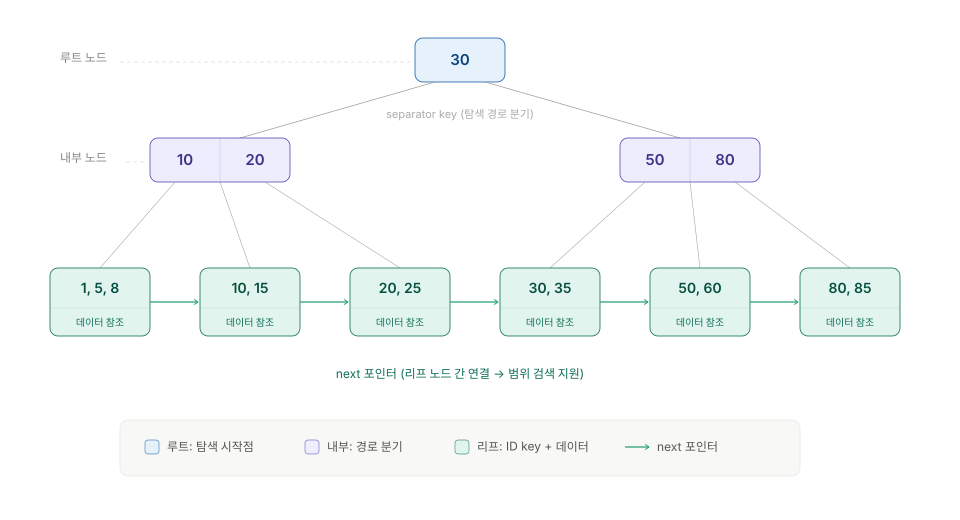
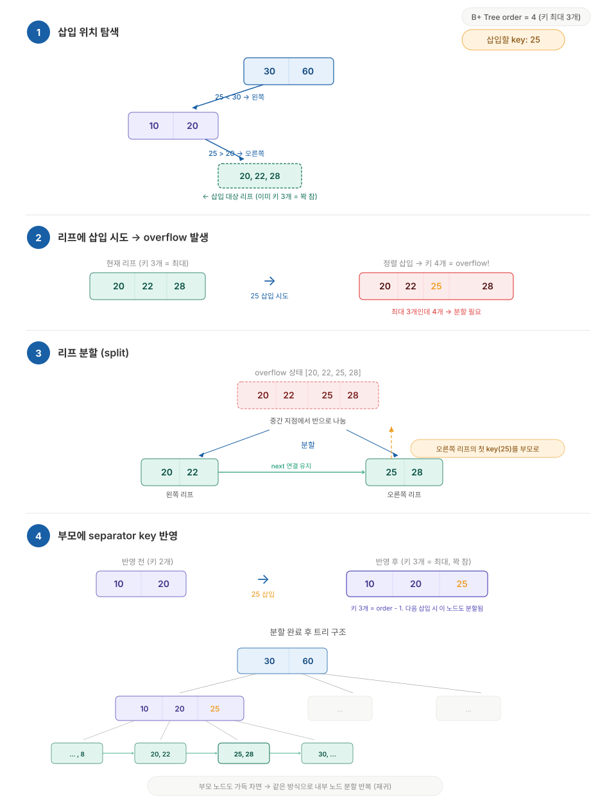
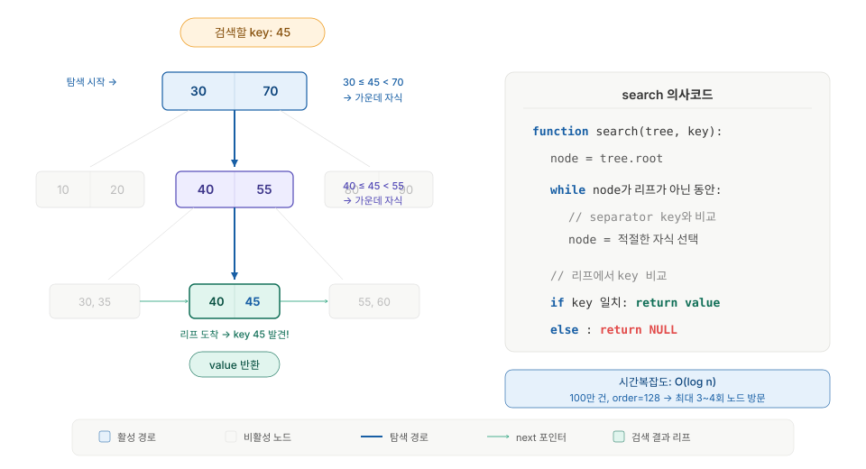
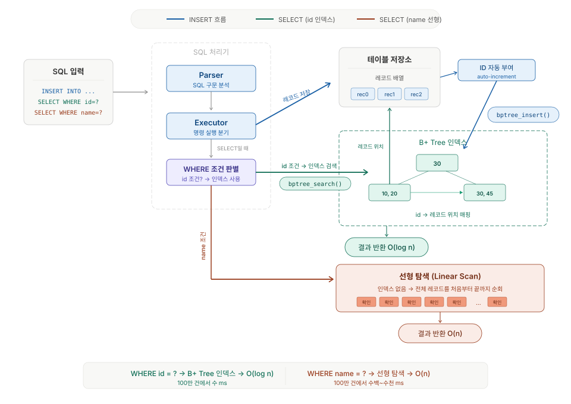
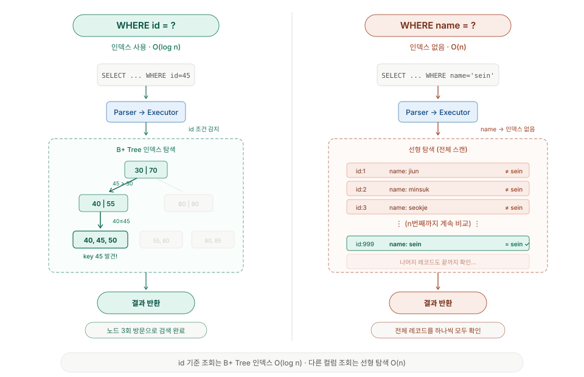
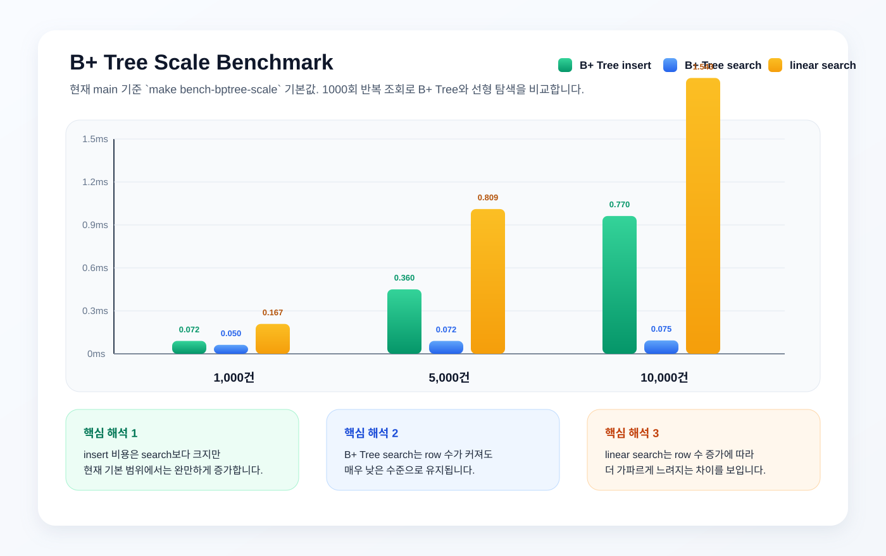

# B+ Tree Index Project

메모리 기반 B+ Tree 인덱스를 C로 구현하고, SQL 처리기와 연동하여 대용량 데이터 검색 성능을 비교하는 프로젝트입니다.

## 1. 빌드 및 실행 방법

```bash
make
make test
make bench
```

추가 실행 명령은 아래와 같습니다.

```bash
make test-sqlparser
make bench-sql-index
make bench-bptree-scale
make sqlparser
python3 server.py
```

- `make`: B+ Tree 실행 파일을 빌드합니다.
- `make test`: 구조 테스트와 search 테스트를 실행합니다.
- `make bench`: 기본 B+ Tree benchmark를 실행합니다.
- `make test-sqlparser`: SQL parser, executor, storage, 인덱스 연동 테스트를 실행합니다.
- `make bench-sql-index`: 기본 SQL 인덱스 benchmark를 실행합니다.
- `make bench-bptree-scale`: 기본 B+ Tree scale benchmark를 실행합니다.
- `make sqlparser`: SQL 처리기 실행 파일을 빌드합니다.
- `python3 server.py`: 브라우저에서 SQL 실행과 benchmark 버튼을 사용할 수 있는 로컬 서버를 실행합니다.

현재 B+ Tree 차수는 `BPTREE_ORDER = 4`로 설정되어 있습니다.
기본 benchmark는 빠른 데모를 위해 작은 row count와 sample 수를 사용하며, 필요하면 compile-time macro로 범위를 확장할 수 있습니다.

## 2. B+ Tree 구조 설명

### 3.1 트리 구조



- 루트 노드는 탐색이 시작되는 지점입니다.
- 내부 노드는 어느 자식으로 내려갈지 결정하는 separator key를 저장합니다.
- 리프 노드는 실제 key와 value를 저장합니다.
- 리프 노드는 `next` 포인터로 연결되어 있어 순차 탐색에 유리합니다.

### 3.2 insert와 split 과정



### 2.3 Search 흐름



- `SEARCH`: root에서 시작해 separator key를 비교하며 leaf까지 내려간 뒤, leaf에서 key를 찾으면 value를 반환합니다.

## 3. 시스템 구조 (SQL 연동)



### 3.1 흐름 요약

- `INSERT` 실행 시 레코드를 저장한 뒤, 부여된 `id` 를 B+ Tree 인덱스에 등록합니다.
- `id` 컬럼을 생략한 `INSERT` 는 auto-id를 생성한 뒤 해당 값을 인덱스 key로 사용합니다.
- `SELECT WHERE id = ?` 는 B+ Tree 인덱스를 사용합니다.
- `SELECT WHERE name = ?` 같은 비인덱스 조건은 기존 선형 탐색을 사용합니다.
- 테이블을 다시 읽을 때는 저장된 row를 기준으로 메모리 인덱스를 다시 구성합니다.

이 프로젝트의 핵심은 B+ Tree를 따로 구현하는 데서 끝나지 않고,
`SELECT WHERE id = ?` 실행 시 실제 조회 경로에서 인덱스를 사용하게 만드는 것입니다.



## 3.2 왜 `id` + B+ Tree를 선택했는가

`SELECT WHERE id = ?` 는 이번 과제에서 가장 중요한 조회 패턴입니다.  
`id` 는 row를 잘 구분하는 key이고, B+ Tree는 equality 조회뿐 아니라 정렬된 구조와 리프 연결을 바탕으로 범위 탐색까지 확장하기 좋은 형태입니다.

B+ Tree 인덱스는 어떤 컬럼에도 적용할 수 있지만, 이번 프로젝트에서는 과제 요구사항에 따라 `id` 컬럼에만 적용하고 `name` 은 비교 대상으로 선형 탐색을 유지했습니다.

| 판단 기준 | 이번 프로젝트의 선택 |
|---|---|
| 가장 중요한 쿼리 패턴 | `SELECT ... WHERE id = ?` |
| 인덱스 대상 컬럼 | `id` |
| 자료구조 | B+ Tree |
| 비교 전략 | `id` 는 B+ Tree 인덱스, `name` 은 선형 탐색으로 두어 benchmark 차이를 명확히 보이도록 했습니다. |

## 3.3 실무 관점과 트레이드오프

기본 과제를 구현한 뒤 "`id`에 B+ Tree를 적용한 선택이 항상 최선일까?"라는 궁금증이 생겼습니다.  
찾아보니 실제 환경에서는 조회 패턴에 따라 서로 다른 인덱스 구조가 사용되고 있었습니다.

| 인덱스 | 강점 | 약점 |
|---|---|---|
| B+ Tree | 가장 범용적이며 `=`, `<`, `>`, `BETWEEN`, `ORDER BY`에 넓게 대응할 수 있습니다. | 쓰기 시 split과 유지 비용이 듭니다. |
| Hash Index | 정확히 같은 값 `=` 조회에 강할 수 있습니다. | 범위 검색과 정렬에는 약합니다. |
| Bitmap Index | 값 종류가 적은 컬럼의 분석성 질의에 유리할 수 있습니다. | 갱신이 잦은 환경에서는 유지 비용이 부담될 수 있습니다. |
| Full-text Index | 문자열 포함 검색에 특화되어 있습니다. | 일반적인 정렬/범위 탐색 용도에는 적합하지 않습니다. |

실무에서는 자주 조회되는 조건, 선택도, 정렬/범위 탐색 여부, 유지 비용을 함께 보고 인덱스를 설계합니다.  
이번 프로젝트는 `WHERE id = ?` 경로를 실제 SQL 처리기에 연결하는 것이 핵심이기 때문에, 범용성이 높은 B+ Tree를 선택했습니다.

## 4. 벤치마크 결과

현재 `main`의 기본 `make bench-sql-index` 실행 결과를 기준으로 정리했습니다.

| 데이터 건수 | id 검색 시간 (B+ Tree) | name 검색 시간 (선형) | 배율 차이 |
|---|---:|---:|---:|
| 20 | 1.211ms | 2.276ms | 1.88x |
| 80 | 1.183ms | 1.691ms | 1.43x |
| 160 | 1.143ms | 2.545ms | 2.23x |


### 4.1 요약

- `WHERE id = ?` 는 B+ Tree 인덱스를 사용해 일정한 시간 안에 조회됩니다.
- `WHERE name = ?` 는 선형 탐색이므로 같은 조건에서도 인덱스 조회보다 느리게 측정됩니다.
- 현재 기본 benchmark는 `20 / 80 / 160` rows, `20`회 lookup 기준으로 빠르게 비교할 수 있도록 구성되어 있습니다.
- 기본 benchmark에서도 `name` 조회는 `id` 조회보다 약 `1.43배 ~ 2.23배` 느리게 나타났습니다.
- 벤치마크 실행 시 현재 차수(`order`)와 row 수가 함께 출력되도록 구성했습니다.

\* 기본 SQL benchmark는 `ID_LOOKUPS=20`, `NAME_LOOKUPS=20`, `SQL_BENCH_ROW_COUNTS=20, 80, 160` 설정을 사용합니다.  
\* fixture는 `storage_insert()`를 사용해 row를 채우고, 이후 `WHERE id = ?` 와 `WHERE name = ?` 조회를 반복 측정합니다.

### 4.2 벤치마크 실행 예시

```bash
make bench-sql-index
make bench-bptree-scale
```

더 큰 benchmark가 필요하면 `benchmark/bench_sql_index.c`와 `benchmark/bench_bptree_scale.c`의 compile-time macro를 조정해 row 수와 sample 수를 확장할 수 있습니다.

### 4.3 B+ Tree 자체 확장성 확인

현재 `main`의 기본 `make bench-bptree-scale` 실행 결과는 아래와 같습니다.

| 데이터 건수 | B+ Tree insert | B+ Tree search | linear search |
|---|---:|---:|---:|
| 1,000 | 0.072ms | 0.050ms | 0.167ms |
| 5,000 | 0.360ms | 0.072ms | 0.809ms |
| 10,000 | 0.770ms | 0.075ms | 1.543ms |



### 4.4 벤치마크 해석

- `bptree search`는 row 수가 커져도 매우 낮은 시간으로 유지됩니다.
- `linear search`는 row 수 증가에 따라 더 가파르게 증가합니다.
- `bptree insert`는 row 저장과 트리 갱신이 함께 일어나므로 search보다 비용이 크지만, 현재 기본 benchmark 범위에서는 완만하게 증가합니다.

## 5. 테스트 결과

### 5.1 통과한 테스트 종류

- B+ Tree 구조 테스트
- search 테스트
- SQL parser / executor 테스트
- storage insert / delete / update / select 테스트
- SQL 인덱스 연동 테스트
- auto-id 생성 및 증가 테스트
- `WHERE id = ?` fast path / 비인덱스 fallback 테스트

### 5.2 실행 결과 예시

```text
Structure tests passed! (6/6)
Search tests passed! (11/11)
197 passed, 0 failed
[EXECUTOR TESTS] passed
All INSERT storage tests passed.
All DELETE storage tests passed.
All UPDATE storage tests passed.
[ROWSET TESTS] 33 passed, 0 failed
[SQL INDEX INTEGRATION] passed
```

### 5.3 추가 검증 명령

```bash
make test
make test-sqlparser
make test_sql_index_integration
```

### 5.4 테스트 요약

- B+ Tree 구조 테스트: `6/6 PASS`
- B+ Tree search 테스트: `11/11 PASS`
- parser 테스트: `197 passed, 0 failed`
- RowSet / storage select 테스트: `33 passed, 0 failed`
- SQL 인덱스 통합 테스트: `passed`
- auto-id 생략 `INSERT` 테스트: `passed`
- auto-id 연속 증가 테스트: `passed`

## 6. 프로젝트 구조

```text
jungle_week7_DB/
├── src/
│   ├── bptree.h
│   ├── bptree.c
│   ├── bptree_main.c
│   ├── parser.c
│   ├── executor.c
│   ├── storage.c
│   └── main.c
├── test/
│   ├── test_structure.c
│   └── test_search.c
├── tests/
│   ├── test_parser.c
│   ├── test_executor.c
│   ├── test_storage_insert.c
│   ├── test_storage_delete.c
│   ├── test_storage_update.c
│   ├── test_storage_select_result.c
│   └── test_sql_index_integration.c
├── benchmark/
│   ├── bench_search.c
│   ├── bench_sql_index.c
│   └── bench_bptree_scale.c
├── index.html
├── server.py
├── docs/
│   ├── bptree-search-simulator.html
│   ├── bptree-structure.svg
│   ├── bptree-insert-split.svg
│   ├── bptree-search.svg
│   ├── bptree-system-architecture.svg
│   ├── bptree-index-vs-linear.svg
│   ├── benchmark-sql-index.svg
│   └── benchmark-bptree-scale.svg
├── Makefile
└── README.md
```

### 6.1 주요 파일 역할

- `src/bptree.h`: B+ Tree 구조체와 함수 선언을 담고 있습니다.
- `src/bptree.c`: search, insert, split의 핵심 구현을 담고 있습니다.
- `src/storage.c`: SQL 처리기와 B+ Tree 인덱스 연동 로직을 담고 있습니다.
- `test/test_structure.c`: B+ Tree 구조 불변식을 검증합니다.
- `test/test_search.c`: search 동작을 검증합니다.
- `tests/test_storage_insert.c`: storage insert와 auto-id 동작을 검증합니다.
- `tests/test_storage_select_result.c`: SQL `SELECT` 결과를 검증합니다.
- `tests/test_sql_index_integration.c`: SQL 인덱스 연동을 검증합니다.
- `benchmark/bench_sql_index.c`: `id` 인덱스 조회와 비인덱스 조회 성능을 비교합니다.
- `benchmark/bench_bptree_scale.c`: 데이터 증가에 따른 B+ Tree 성능을 확인합니다.
- `index.html`: SQL 실행과 benchmark 버튼을 제공하는 브라우저 UI입니다.
- `server.py`: 브라우저 요청을 받아 `sqlparser`와 benchmark 타깃을 실행하는 로컬 HTTP 서버입니다.
- `docs/bptree-search-simulator.html`: B+ Tree 탐색 흐름을 시각적으로 확인하는 보조 자료입니다.

## 7. 향후 확장 방향

- 범위 검색, delete, 다중 인덱스 지원으로 확장할 수 있습니다.
- 메모리 기반 구조를 디스크 페이지 기반 구조로 확장하면 실제 DBMS에 더 가까운 형태로 발전시킬 수 있습니다.
